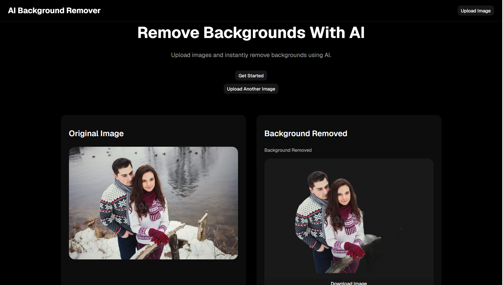

# AI Background Remover

An AI-powered web application that removes image backgrounds using deep learning-based image segmentation. The application features a React frontend and a FastAPI backend, allowing users to upload images and receive background-free versions within seconds.

## Live Demo

### Frontend
https://ai-background-remover-black.vercel.app

### Backend
https://ai-background-remover-production-6371.up.railway.app

---

## Features

- Upload images directly from the browser
- AI-powered background removal
- Fast image processing
- Responsive user interface
- React frontend with TypeScript
- FastAPI backend
- Cloud deployment using Vercel and Railway

---

## Demo

### Original Image
Upload an image containing a person, object, or subject.

### Processed Image
The AI removes the background and returns a transparent PNG image ready for download and use.

---

## How It Works

1. The user uploads an image through the React frontend.
2. The image is sent to the FastAPI backend.
3. The backend processes the image using the `rembg` library.
4. `rembg` utilizes deep-learning image segmentation models (U²-Net) to identify the foreground subject.
5. The background is removed.
6. The processed image is returned to the frontend for preview and download.

---

## Architecture

```text
User
  |
  v
React Frontend
  |
  v
FastAPI Backend
  |
  v
rembg (U²-Net)
  |
  v
Processed Image
  |
  v
User Download
```

---

## Tech Stack

### Frontend

- React
- TypeScript
- Vite
- HTML
- CSS

### Backend

- Python
- FastAPI
- rembg
- Uvicorn

### AI / Image Processing

- rembg
- U²-Net Image Segmentation Model

### Deployment

- Vercel
- Railway

---

## Project Structure

```text
ai-background-remover/
│
├── frontend/
│   ├── src/
│   ├── public/
│   └── package.json
│
├── backend/
│   ├── main.py
│   ├── requirements.txt
│   └── ...
│
└── README.md
```

---

## Installation

### Clone the Repository

```bash
git clone https://github.com/emmanuelboop/ai-background-remover.git
cd ai-background-remover
```

---

## Frontend Setup

```bash
npm install
npm run dev
```

The frontend will run on:

```text
http://localhost:5173
```

---

## Backend Setup

Create a virtual environment:

```bash
python -m venv venv
```

Activate the environment:

### Windows

```bash
venv\Scripts\activate
```

### Mac/Linux

```bash
source venv/bin/activate
```

Install dependencies:

```bash
pip install -r requirements.txt
```

Run the FastAPI server:

```bash
uvicorn main:app --reload
```

The backend will run on:

```text
http://localhost:8000
```

---

## Challenges Solved

During development, several technical challenges were addressed:

- Handling image uploads between React and FastAPI
- Managing binary image data transfer between frontend and backend
- Processing images efficiently while maintaining responsiveness
- Deploying machine-learning inference on Railway
- Configuring cross-origin requests (CORS) between frontend and backend
- Returning processed images for immediate user download

---

## What I Learned

This project helped me gain practical experience with:

- Building full-stack applications
- React and TypeScript development
- FastAPI backend development
- File upload handling
- API communication between frontend and backend
- Machine learning model integration
- Cloud deployment using Vercel and Railway
- Image processing workflows
- Debugging production deployments

---

## Future Improvements

- Batch image processing
- User authentication
- Image history and storage
- Download optimization
- Multiple output formats
- Background replacement functionality
- AI-powered image enhancement tools

---

## Screenshots

### Application



---

## Why I Built This Project

I built this project to gain hands-on experience integrating machine learning capabilities into a production-ready web application. The goal was to combine modern frontend development, backend API development, cloud deployment, and AI-powered image processing into a single end-to-end application.

---

## Author

**Emmanuel Olabisi**

GitHub: https://github.com/emmanuelboop